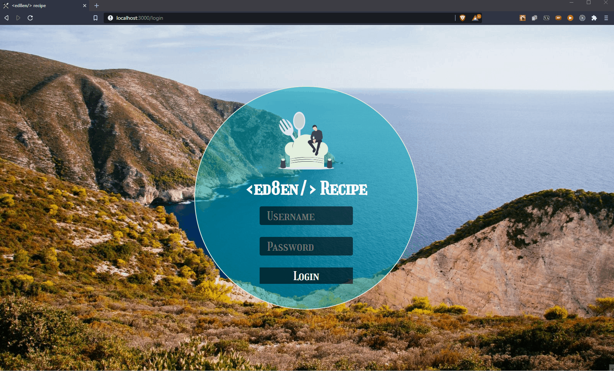

# Project-004 : Recipe App (RC-04)

## Description

Project aims to create a Recipe App.

## Problem Statement

- We are adding a new project to our portfolios. So you and your colleagues have started to work on the project.

## Project Skeleton

## Expected Outcome

## Objective

Build a Recipe App using ReactJS.

### At the end of the project, following topics are to be covered;

- HTML

- CSS

- JS

- ReactJS

### At the end of the project, students will be able to;

- improve coding skills within HTML & CSS & JS & ReactJS.

- use git commands (push, pull, commit, add etc.) and Github as Version Control System.

## Steps to Solution

- Step 1: Create React App using `npx create-react-app recipe-app`

- Step 2: Signup `https://developer.edamam.com/edamam-docs-recipe-api` and get api key.

- Step 3 : Using api key for getting data from `https://api.edamam.com/search?q=${query}&app_id=${APP_ID}&app_key=${APP_KEY}&mealType=${meal}`.

- Step 4: You can use css frameworks like Bootstrap, Semantic UI.

- Step 6: Add project gif to your project and README.md file.

## Notes

- You can add additional functionalities to your app.

**
&#9786; Happy Coding &#9997;
**
